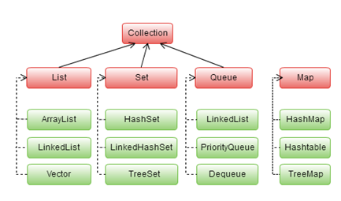
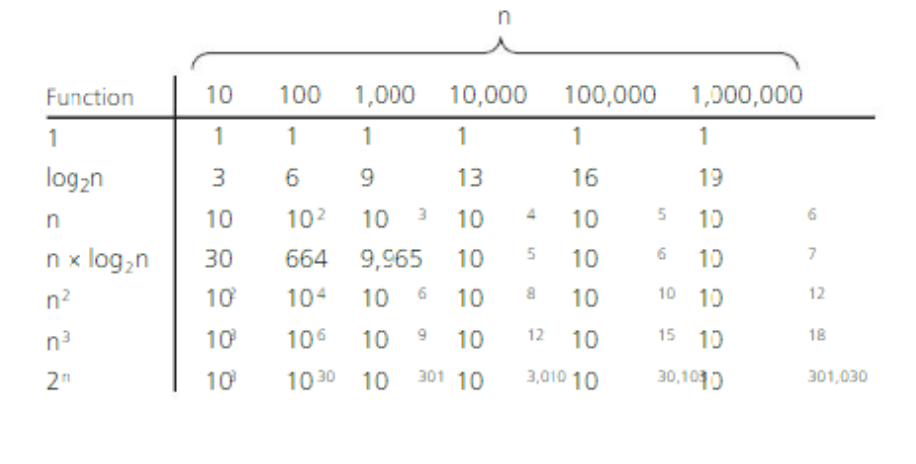

# Abstract data types

Knowing about different ways to store data is crucial when writing software. Right now it might not be that clear because you are working with small amounts of data in your projects. But once you start working with 1000 of objects, maybe even millions of objects then knowing different data structures is absolutely crucial. (Java collection Framework)

Having an idea of how slow/fast your program will be is also a very useful skill. (Big O notation)


## Learning goals

- Understand purpose of ADT
- Knows Javas collection framework
- Complexity O notation for loops, methods and algorithms


## Interface example

An interface is a contract (or a protocol, or a common understanding)  of what a class can do. Using interfaces two objects can communicate based on the contract defined in the interface, instead of their specific implementation.

An interface defines what methods and attributes a class should have. It works like this:

```java
interface User {
    public void addName(); // interface method (does not have a body)
    public String getName(); // interface method (does not have a body)
}
```

This interface defines two methods: `addName` and `getName`. Any class that implements this interface **has to have** these two methods!


```java
public class WebUser implements User {
    public void addName() {}

    public String getName() {
        return "name";
    }
}
```

The `WebUser` class `implements` the `User` interface. Meaning it has to have the  `addName` and `getName` methods.


## Abstract data types

A specification of a type of data and the operations that can be performed on it.

**An ADT specifies operations that can be performed on data without specifying exactly how those operations are implemented.** 

In Java, ADTs are specified by `interfaces`. Each ADT's operations are specified by the methods of its interface. For example, both LinkedList and ArrayList implement an interface in the java.util package called List. The List interface declares all the common methods that both types of lists implement. You can find the interface here: https://docs.oracle.com/javase/8/docs/api/java/util/List.html

It's smart because we have a strick interface with a contract that specifies how to use the data.

Good interface design makes us as developers not even think about what lies behind the code we are using it. We are just using the methods. 

Lets take a look at the `List` interface in Java!


### Collection (Java collection framework)

A collection is an object that stores a group of other objects, called its *elements.* Entities that store and manage data are also called *data structures.* 

Java provides a large group of useful collections that allow you to store, access, search, sort, and manipulate data in a variety of ways. Together, these collections and classes are known as the *Java Collections Framework.*





```java
// Different types (ArrayList, LinkedList and Vector), same interface (to add items, we use the add method)
ArrayList<String> names = new ArrayList<String>();
names.add("asd");

LinkedList<String> names2 = new LinkedList<String>();
names2.add("asd");

Vector names3 =  new Vector();
names3.add("asd");
```


Some examples of collection interfaces:

- **List**: An ordered collection of elements, often accessed by integer indexes or by iteration.
- **Queue**: A collection in which elements are removed in the same order in which they were added.
- **Set**: A collection of elements that is guaranteed to contain no duplicates.
- **Map**: A collection of key/value pairs in which each key is associated with a corresponding value.

Java provides a large group of useful collections that allow you to store, access, search, sort, and manipulate data in a variety of ways. Together, these collections and classes are known as the *Java Collections Framework.* This framework is largely contained in the package java.util.

All these types have different purposes. 


### New List type (the cool new kid in town)

Okay so enough of all these boring types like `ArrayList`, `HashSet` and `LinkedList`. We want to create a cool new datatype! 

Hopefully it is going to be so cool that the people behind Java will actually accept it into the Java Collection Framework 🤞


 Okay but what should the purpose of this list be? 

> It should be for [Rockstart developers](https://hackernoon.com/the-myth-of-a-rockstar-developer-e6564bd51b5c) that are a bit daring and okay with taking risks


Lets call this new datastructure for `CoolList`. It should be a `List` which means it should implement the `List` `interface`. 

`CoolList` will only use `Strings` since everything else is irrelevant 😂

Since it will `implement` the `List` interface there are lots of methods we need to implement like `add`, `size`, `get` and so on.

On top of those methods we will be adding some unique ["cool"](https://giphy.com/gifs/30-rock-sme-how-do-you-1Qdp4trljSkY8) features

| Method name                 | Description                                                  |
| --------------------------- | ------------------------------------------------------------ |
| `deleteRandomItem`          | Deletes a random item in the list                            |
| `deleteRandomNumberOfItems` | Deletes a random number of items in the list                 |
| `nukeTheList`               | Removes all items in the array                               |
| `emojiThisList`             | Replaces all items with emojis                               |
| `rickRoll`                  | Replace a random item with the link to the [rick roll video](https://www.youtube.com/watch?v=dQw4w9WgXcQ) |
| `YourMethodHere`            | Implement a fun method you think should be part of `CoolList` |


### Exercise - 60 min

You have to create a new List just like `CoolType` that implements the `List` interface (behaves like a list). What name you give it is up to you.

Add both some of the expected methods to be a `List` (`add`, `size`, `get`) and add some unique methods (you can take some of the methods i have written above)


## Big O notation

Watch this video to get an overview of why we talk about Big O notation: https://www.youtube.com/watch?v=RGuJga2Gl_k


Big O notation. Helps us as figure out how fast our program will run. How does the runtime scale with respect to some inputs. It is a simplified analysis of an algorithms efficiency.

Usually talking about works case. Big O is an approximation of how long time a program will take to run. 


### Constant time

O(1) 

Constant time with respect to the input. If you double the input the program will still take the same time.


```java
// names we say is an ArrayList
String name = names.get(0);
System.out.println(name);
```


### Linear time

O(n)

If you double the input you double the time the program takes. Seen typically with iterating through a list. if the array has 1000 items it will take 1000 times longer than if the array had one item. 


```java
ArrayList<String> names = new ArrayList<>();
names.add("Henriette");
for (String name : names) {
    System.out.println(name);
}
```


### Quadratic time

O(N^2)

If you double the input you quardouble the time the program takes. Typically seen with a nested foreach


```java
// Lets say the ArrayList firstnames has 1000 elements
// Lets say the ArrayList lastnames has 1000 elements
for (String firstName : firstNames) {
    for (String lastname : lastNames) {
        System.out.println(firstName + " " + lastname);
    }
}
```





### Example

What is the big O notation for this program?

```java
ArrayList<String> firstNames = new ArrayList<>();
ArrayList<String> lastNames = new ArrayList<>();
firstNames.add("Henriette");
firstNames.add("Pedersen");

for (String firstName : firstNames) {
    System.out.println(firstName);
}

for (String firstName : firstNames) {
    for (String lastname : lastNames) {
        System.out.println(firstName + " " + lastname);
    }
}
```


What is the big O notation for this program?

```java
if (x > 0) {
    // In here the program takes O(1)
} else if (x < 0) {
    // In here the program takes O(logn)
} else {
    // In here the program takes O(n^2)
}
```


### Rules for calculating big O

- Drop constants.  O(2n) its just O(n). That is because that the most important part is the O(N) part. If its double that time does not really matter in the bigger picture
- Drop low order terms. with fx O(1) + O(n). Here O(n) will completely dominate the runtime. n + 10 for n=10000. Here it does not matter to have the 10 part. In other words: Find the max of the O notation and that is the answer

https://www.baeldung.com/java-algorithm-complexity


### Exercises until class ends

You need to figure out the Big O for these code snippets. They are written in js. You dont have to understand what the code exactly does. 


**1**

```java
public Boolean isEven(Integer value) {
    if (value % 2 == 0) {
      return true;
    } else {
      return false;
    } 
}
```


**2**

```java
public Boolean areYouHere(ArrayList<Integer> array1, ArrayList<Integer> array2) {
  for (Integer itemArray1 : array1) {
    for (Integer itemArray2 : array2) {
      if (itemArray1 == itemArray2) return true;
    }
  }

  return false;
}
```


**3**

```java
public ArrayList<Integer> doubleArrayValues(ArrayList<Integer> array) {
  for (int i = 0; i < array.size(); i++) {
    Integer number = array.get(i);
    array.set(i, number * 2);
  }

  return array;
}
```


**4**

```java
public Integer naiveSearch(ArrayList<Integer> array, Integer itemToFind) {
  Integer itemToReturn = new Integer();
  for (Integer item : array) {
    if(item == itemToFind) {
      item = itemToReturn;
    }
  }
  
  return itemToReturn;
}
```


**5**

```java
public String createPairs(ArrayList<Integer> array1, ArrayList<Integer> array2) {
  String pair = "";
  for (Integer itemArray1 : array1) {
    for (Integer itemArray2 : array2) {
      pair = itemArray1 + ", " + itemArray2;
    }
  }

  return pair;
}
```


**6**

```java
public ArrayList<Integer> generateFib(Integer n) {
  ArrayList<Integer> result = new ArrayList<>();

  for (int i = 0; i < n; i++) {
    if (i == 1) {
      result.add(0);
    }
    else if (i == 2) {
      result.add(1);
    }
    else {
      result.add(result.get(i - 2) + result.get(i - 3));
    }
  }

  return result;
}
```


**7**

```java
public Object findRandomElement(ArrayList<Integer> array) {
  Integer randomIndex = rand.nextInt(array.size());
  return array.get(randomIndex);
}
```


**8**

```java
public Boolean isPrime(Integer n) {
  if (n < 2 || n % 1 != 0) {
    return false;
  }
  for (int i = 2; i < n; ++i) {
    if (n % i == 0) {
      return false;
    }
  }
  return true;
}
```


**9**

```java
public Integer factorialOf(Integer n) {
  switch(n) {
    case 0:
      return 1;
    case 1:
      return 1;
    default:
      return n * factorialOf(n -1);
  }
}
```


### Other videos

https://www.youtube.com/watch?v=kgBjXUE_Nwc

https://www.youtube.com/watch?v=kPRA0W1kECg